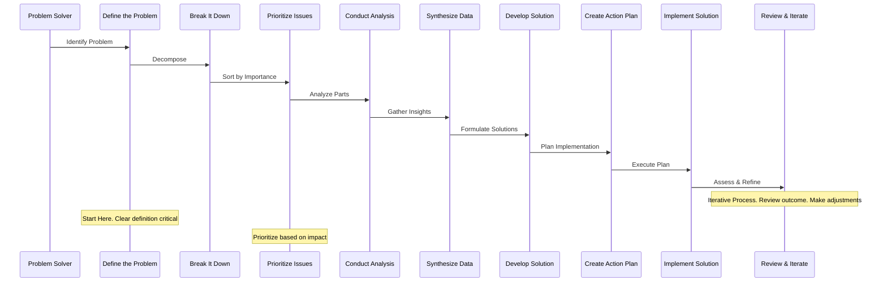

Hey there, fellow papermod enthusiasts! If you're like me, you're always on the lookout for ways to make your Hugo blog content more engaging and easy to understand. That's why I'm excited to share with you my experience of adding Mermaid.js to my Hugo Papermod site using the CDN method. 

Mermaid.js is a fantastic tool that allows you to create beautiful, interactive diagrams and flowcharts right in your web browser. With its simple markdown-like syntax, you can create complex visualizations in no time - no need to be a coding expert or a design whiz! From mapping out project timelines to illustrating technical concepts, Mermaid.js is the perfect solution for anyone looking to add a visual punch to their online content. 

And the best part? It's incredibly easy to integrate into your website or blog, which is exactly what we'll be covering in this post!

Here is a simple example of a sequence diagram created using Mermaid.js based on the book [Bulletproof Problem Solving](https://bulletproofproblemsolving.com/) by Charles Conn and Robert McLean. By the way, I highly recommend this book if you're interested in improving your problem-solving skills!



# How to 
**Credit: [Joe Mooring](https://discourse.gohugo.io/u/jmooring/summary)**

1. Add the following to your `layouts/_default/_markup/render-codeblock-mermaid.html` file:

```html
<div class="mermaid">
  {{- .Inner | safeHTML }}
</div>
{{ .Page.Store.Set "hasMermaid" true }}
```

2. Add the following to your `layouts/partials/single.html` file:

```html
{{ if .Page.Store.Get "hasMermaid" }}
  <script type="module">
    import mermaid from 'https://cdn.jsdelivr.net/npm/mermaid/dist/mermaid.esm.min.mjs';
    mermaid.initialize({ startOnLoad: true });
  </script>
{{ end }}
```
You could also add the above code to `scrips.html` or `head.html` file.

This method did not work for `js-sequence-diagrams`. I guess I'll have to try using a different approach and include the library instead in the static files. 

Until next time, happy blogging! 🚀