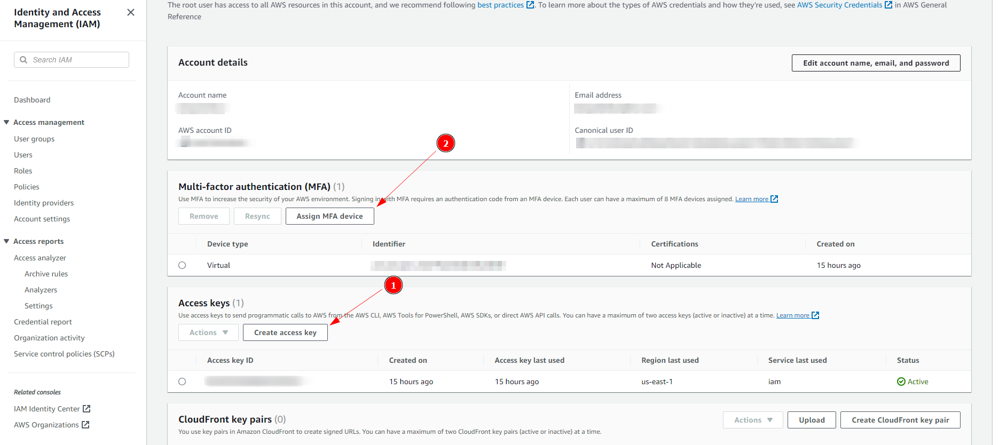

I manage my Hugo site (versioning and deployment) via GitHub. One key issue with this setup is that images eventually make the repository heavier, making push and pull slower and unnecessarily gobbling GitHub's resources for purposes that it is not meant for. A common option to manage this issue is to use image hosting and resizing services like Cloudimage and Cloudkit. A key issue I have with these services is the inability to maintain a persistent backup elsewhere. Plus, this can get quickly expensive if you overshoot your Free Tier storage quota. 

In this guide, I will describe my process of setting up an AWS S3 bucket for hosting static images. One disadvantage of this approach is that if you hate terminal, you are not going to like it. But then, if you hated terminal, you'd be using Squarespace and not Hugo.

**Step 1: Set Up an AWS Account**
1. Visit the AWS official website: [https://aws.amazon.com/](https://aws.amazon.com/)
2. Click on the "Create an AWS Account" button and follow the instructions to create your account.
3. Once your account is created, log in to the AWS Management Console.

**Step 2: Get Security Credentials**
1. In the AWS Management Console, navigate to security credentials page.
2. Navigate to the "IAM" (Identity and Access Management) service.
3. Click on "Users" in the left sidebar and then click on "Add user."
4. Enter a name for the user (e.g., "imagehost") and select "Programmatic access."
5. Attach an existing policy directly: Search for and select the "AmazonS3FullAccess" policy to grant full access to S3.
6. Review the settings and create the user. Copy the access key ID and secret access key displayed on the final page.

**Note:** Save these credentials safely, inside a password manager. Once you close the page, they are gone. 

8. 

**Step 3: Log into AWS CLI on Windows**
1. Install the AWS CLI on your Windows machine by downloading the installer from [https://aws.amazon.com/cli/](https://aws.amazon.com/cli/).
2. Open a Command Prompt window and run the command: `aws configure`
3. Enter the access key ID and secret access key from Step 2 when prompted.
4. Choose a default region (e.g., "us-east-1") and set the output format to "json."

**Step 4: Create an S3 Bucket**
1. In the Command Prompt, run the following command to create an S3 bucket:
```sh
aws s3api create-bucket --bucket your-image-host-bucket --region us-east-1
```

**Step 5: Create an IAM User and Assign Bucket Permissions**
1. In the AWS Management Console, navigate to the "IAM" service.
2. Click on "Users" and select the IAM user you created in Step 2.
3. Click on the "Add permissions" button.
4. Choose "Attach existing policies directly" and search for and select the "AmazonS3FullAccess" policy.
5. Review and add permissions.

**Step 6: Make the S3 Bucket Public**
1. In the AWS Management Console, navigate to the "S3" service.
2. Select your S3 bucket ("your-image-host-bucket").
3. Click on the "Permissions" tab and then the "Bucket Policy" option.
4. Add the following policy to make the bucket publicly accessible. Replace "your-image-host-bucket" with your actual bucket name:
```json
{
  "Version": "2012-10-17",
  "Statement": [
    {
      "Sid": "PublicReadGetObject",
      "Effect": "Allow",
      "Principal": "*",
      "Action": ["s3:GetObject"],
      "Resource": ["arn:aws:s3:::your-image-host-bucket/*"]
    }
  ]
}
```

**Step 7: Upload Images and Generate URLs**
1. Open a Command Prompt window and navigate to the folder containing your image.
2. Run the following command to upload the image to your S3 bucket and generate a public URL:
```sh
aws s3 cp your-image.jpg s3://your-image-host-bucket/
```
Replace "your-image.jpg" with the actual image filename and "your-image-host-bucket" with your bucket name.

**Step 8: Set Up a Clone for Alternative Script**
If you're interested in using a script to upload images, you can consider using a simple Bash script. Here's an example:
```bash
#!/bin/bash
aws s3 cp your-image.jpg s3://your-image-host-bucket/
echo "Image uploaded. Public URL: https://your-image-host-bucket.s3.amazonaws.com/your-image.jpg"
```
Save this script to a file (e.g., `upload-image.sh`), make it executable using `chmod +x upload-image.sh`, and run it using `./upload-image.sh`.

Conclusion:
Congratulations! You've successfully set up an AWS S3 bucket for hosting static images on your blog. You can now easily upload images using either the AWS CLI or a script and embed the generated URLs in your markdown pages. This will help improve your blog's performance and user experience.